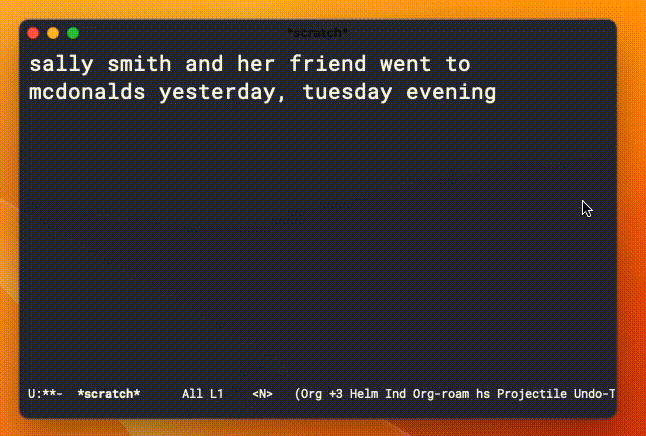

# gpt-macro
Connect GPT-3 to Emacs and run "semantic" kbd macros

# About

# Usage
This was a super quick implementation and currently uses the OpenAI Python package and interfaces with a Python script.
To use, add your OpenAI API key and set the Python script path in `gpt-macro.el` 

# *TODO:*
- Rewrite to elisp-only via curl to interface with API. (Was experiencing a bug with passing in single quotes via curl)
